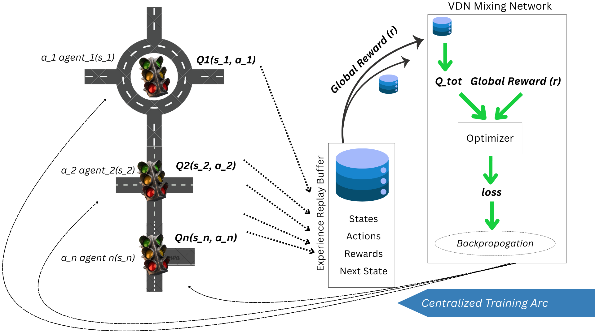
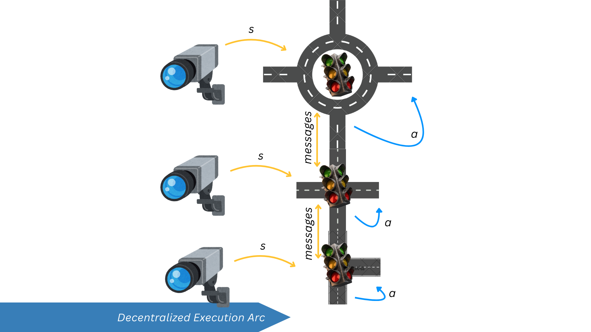

# Multi-Agent Traffic Flow Coordination with VDN

This component implements a Multi-Agent Reinforcement Learning (MARL) system using the Value Decomposition Network (VDN) framework to enable coordinated traffic signal control across multiple intersections. By allowing traffic lights to communicate and collaborate, this system reduces city-wide congestion and creates adaptive traffic flow optimization.

## 🚦 Project Overview
Traditional traffic systems operate in isolation, where each intersection makes decisions based only on local information. This leads to sub-optimal global performance and propagating congestion waves throughout the city network.

This component solves this problem by implementing a Centralized Training with Decentralized Execution (CTDE) paradigm, where:
➡️During training, agents learn to cooperate by sharing a global reward signal
➡️During execution, each intersection operates independently using only local observations and lightweight neighbor communication
➡️The Value Decomposition Network (VDN) architecture enables agents to learn how their individual actions contribute to overall city-wide traffic optimization

## 🧠 WORKFLOW 

Simply put; the whole workflow for this component begins in two main phases.

### 1. Centralized Training Phase:
✔️ Agents interact with SUMO, taking actions based on local state.
✔️ Experiences (state, action, reward, next state) are stored in a shared replay buffer.
✔️ A central trainer (VDN mixer network) samples batches and updates all agent networks using the global reward signal.

### 1. Decentralized Execution Phase:
✔️ Trained agents are deployed.
✔️ Each agent uses its local observation (from SUMO via TraCI) and lightweight messages from neighbors.
✔️ It feeds this into its own neural network to choose the best action independently.
✔️ The action is executed in SUMO via TraCI.
